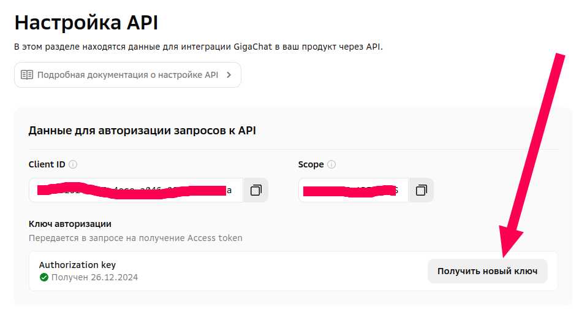

# Hackathon. Подготовили: Груданов Николай и Лемцё Виталий

## Презентация

[Презентация с выступления](docs/ХакатонПрезентация.pdf)

## Настройка

Для запустка данного проекта нужно вписать ваши параметры для Telegram и GigaChat-API в конфиг файле.

Он выглядит следющим образом

```python
bot_token = os.getenv("BOT_TOKEN", "ТУТ_ВАШ_ТОКЕН")

gigachat_scope = os.getenv("GIGACHAT_SCOPE", "GIGACHAT_API_PERS")
gigachat_auth_key = os.getenv("GIGACHAT_AUTH_KEY", "ТУТ_ВАШ_ТОКЕН")
gigachat_model = "GigaChat-Max"

predict_model = "bert"  # bert | rfr | lstm
```
Сам файл можно найти тут [config.py](config.py)

## Токены

Для получения токенов вам потребуется:

* Telegram. Чтобы получить токен для Telegram бота, выполните следующие шаги:

  1. Откройте Telegram и найдите бота @BotFather в поисковой строке.
  2. Начните диалог с @BotFather, отправив команду `/start`.
  3. Введите команду /newbot для создания нового бота.
  4. Придумайте имя для вашего бота и введите его.
  5. Задайте уникальное имя пользователя для бота, которое должно заканчиваться на "bot" (например, TestBot или test_bot).
  6. После успешного создания бота, @BotFather предоставит вам токен - длинную строку символов.

* GigaChat-API:
  1. Зарегистрироваться или авторизоватся по сбер ID в личном кабинете GigaChat Studio [https://developers.sber.ru/studio/workspaces/](https://developers.sber.ru/studio/workspaces/)
  2. Получить токен. На картинке ниже проилюстрировано как это сделать 
  
  3. Если что-то не получается, то ознакомтесь с документацией по API. [Документация](https://developers.sber.ru/docs/ru/gigachat/individuals-quickstart#shag-2-poluchenie-tokena-dostupa) 

## Обучение и анализ

Для обучения моделей читайте [Про обученияе и анализ данных](model/README.md)

## Окружение

Для запуска кода можно воскользоватся следющими файлами из директории [start_env/](./start_env/) и командами.

1. Без GPU:
   * **Способ 1:**
      * В папке env есть файл с окруженем conda [ml_env_py312.yml](./start_env//ml_env_py312.yml). 
      * Для установки выполните команду `conda env create -f ml_env_py312.yml`
   * **Способ 2:**
      * В папке env есть файл с зависимосятми [requirements.txt](./start_env//requirements.txt). 
      * Для установки выполните команду `pip install -r requirements.txt`
2. С GPU:
   * В папке env есть файл с окруженем conda [rocm_env_py310.yml](./start_env//rocm_env_py310.yml).
   * Для установки выполните команду `conda env create -f rocm_env_py310.yml`

Для запуска на AMD видеокарте потребуется установка rocm.

Ниже ссылки на иструкции:

* [Installation (Linux)](https://rocm.docs.amd.com/en/docs-5.7.0/deploy/linux/os-native/install.html)
* [rocm_arch_guide](https://gist.github.com/augustin-laurent/d29f026cdb53a4dff50a400c129d3ea7)
* [Multi AMD GPU Setup for AI Development on Ubuntu](https://github.com/eliranwong/MultiAMDGPU_AIDev_Ubuntu)
* [ROCm JAX 0.4.35](https://github.com/ROCm/jax/releases/tag/rocm-jax-v0.4.35)